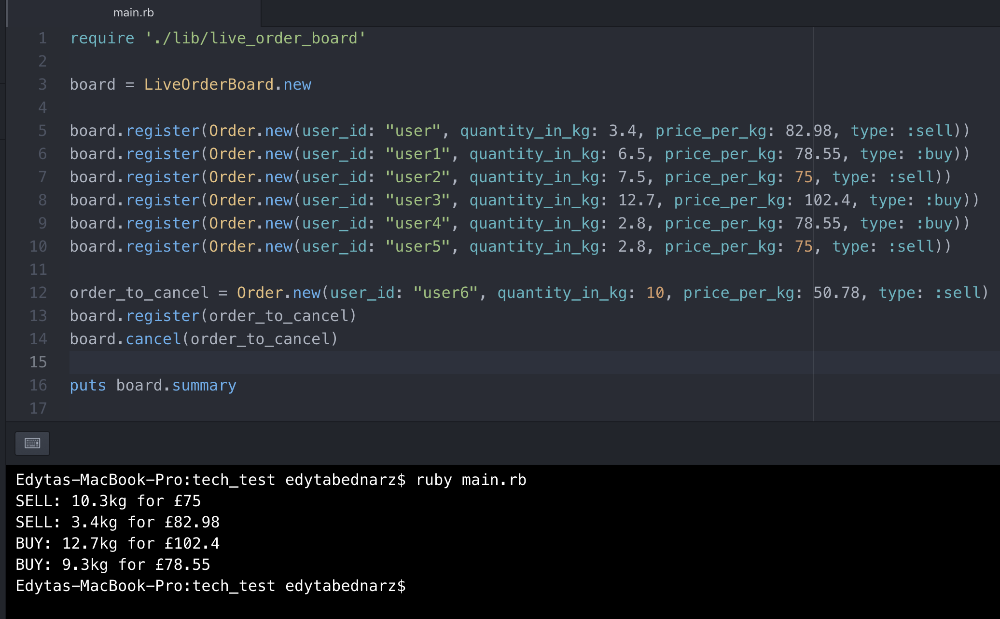

## SilverBars

A Ruby program which generates a summary of buy and sell orders and displays it as described in User Stories.

### User Stories

```
As a User
I can register an order with the following details:
-  user id
-  order quantity in kg (e.g.: 3.5 kg)
-  price per kg (e.g.: £303)
-  order type: BUY or SELL.
```

```
As a User
I can see SELL orders on the board in ascending order.
```

```
As a User
I can see BUY orders on the board in descending order.
```

```
As User
I can see merged orders, where quantities of orders with the same price and type add up.

For example, Imagine we have received the following orders:

a) SELL: 3.5 kg for £306 [user1]
b) SELL: 1.2 kg for £310 [user2]
c) SELL: 1.5 kg for £307 [user3]
d) SELL: 2.0 kg for £306 [user4]

Our ‘Live Order Board’ should provide us with the following summary information:

SELL: 5.5 kg for £306 // order a + order d
SELL: 1.5 kg for £307 // order c
SELL: 1.2 kg for £310 // order b
```

```
As a User
I can cancel a registered order - this will remove the order from 'Live Order Board.'
```

### Ruby version

This project was developed using Ruby 2.5.1p57 but should run fine on other ruby versions.
If you encounter issues running the program, please update your ruby version.

To check your ruby version:

```
$ ruby -v
```

### To install dependencies:

(You might need to install Bundler first):

```
$ gem install bundler
```

Then:

```
$ bundle install
```

### To run tests:

```
$ rspec
```

### To run linting:

```
$ rubocop
```

### To run the demonstration script

```
$ ruby main.rb
```

You can change/inspect the code in main.rb to see how it works.



Alternatively, you can check the specs to see working examples.
